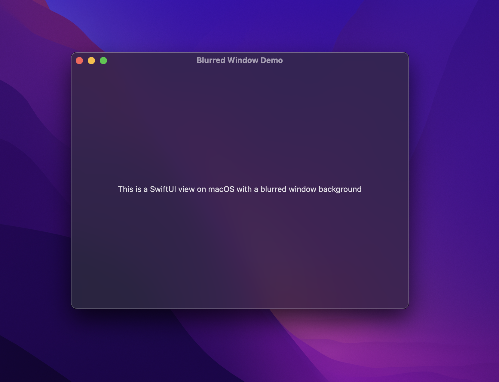

# SwiftUI Examples

A collection of small SwiftUI bits and pieces I've figured out as I've learned and wanted to document for myself and others.

## Demos

Open and run the `SwiftUI Examples.xcodeproj` and run the target for each platform to see the demos.

### macOS

#### Blurred window background

- Adding blurred background for your macOS window. See [Source/BlurredWindowContentView.swift](Source/BlurredWindowContentView.swift)

## License

All code is available under the MIT license.

## Author 
- Zach Waugh
- [https://zachwaugh.com](https://zachwaugh.com)
- [@zachwaugh](https://twitter.com/zachwaugh)
